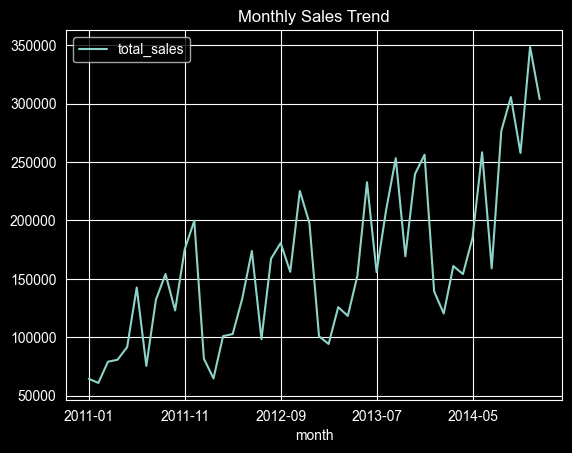
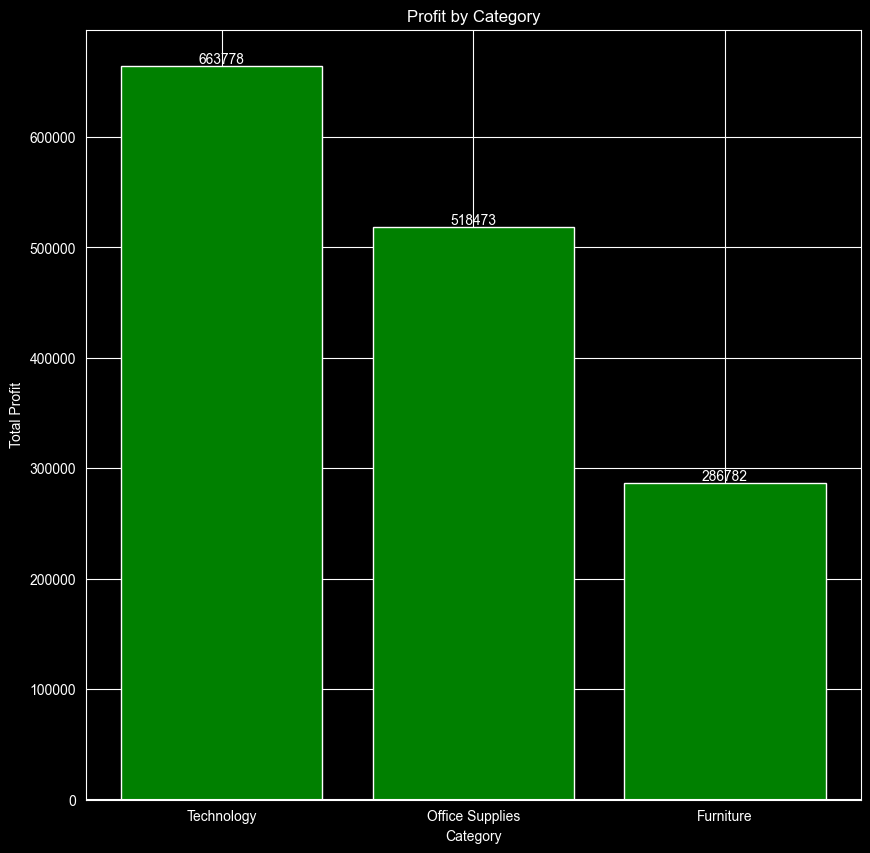
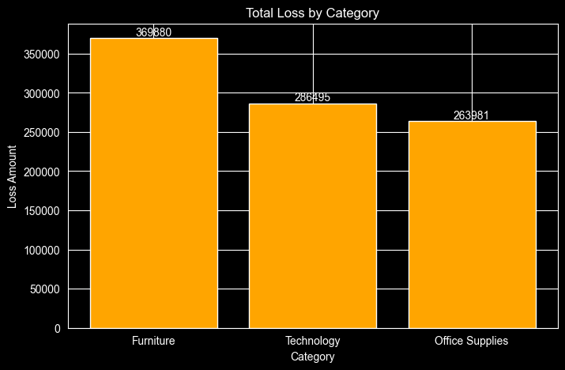
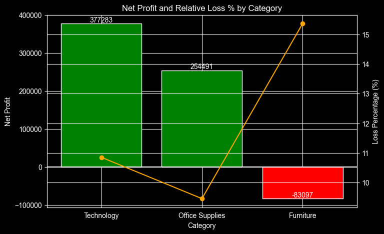
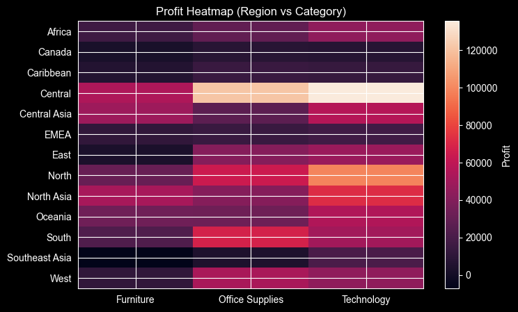
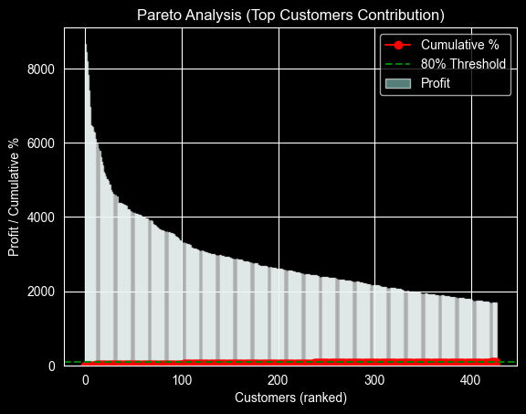

# 📊 Superstore Sales Analysis

> 📊 Data Analysis project using Python to extract actionable business insights from retail sales data.

---

## 🚀 Overview

This project performs **Exploratory Data Analysis (EDA)** on a superstore dataset to understand **sales performance, profitability, and customer trends**.

---

## 📊 Analysis & Insights

---

### 1️⃣ Sales Trend Over Time



➡️ Sales show fluctuations over time with noticeable peak periods, indicating **seasonal demand patterns**.

---

➡️ Growth ratio highlights **inconsistent growth**, suggesting opportunities to stabilize revenue through better planning.

---

### 3️⃣ Sales vs Profitability by Category



➡️ Technology generates the highest profit, while Furniture shows **lower profitability despite strong sales**.

---

### 4️⃣ Loss Analysis by Category



➡️ Certain categories contribute significantly to losses, indicating **pricing or cost inefficiencies**.

---

### 5️⃣ Net Profit vs Loss Percentage



➡️ The imbalance between profit and loss highlights **areas requiring cost control and optimization**.

---

### 6️⃣ Regional Performance Heatmap



➡️ Some regions underperform across categories, suggesting **geographic inefficiencies and market gaps**.

---

### 7️⃣ Pareto Analysis (80/20 Rule)



➡️ A small percentage of categories/customers contribute to the majority of profit, confirming the **Pareto Principle (80/20 rule)**.

---

## 🧠 Key Business Insights

* 📈 Revenue is driven by a few high-performing categories
* 📉 Losses are concentrated in specific segments
* 🌍 Regional disparities affect overall profitability
* 🔄 Sales growth is inconsistent and needs stabilization
* 🎯 Focus on top contributors can maximize profit

---
# Power BI Dashboard

## Dashboard Features
- KPI Cards
- Sales Trend Analysis
- Profit by State
- Dynamic Titles
- Scatter Plot
- Interactive Slicers
- Top 5 Customers Analysis

## Dashboard Preview


## Dashboard File
The interactive Power BI dashboard is available in:

powerbi-dashboard/superstore_sales_dashboard.pbix
## 🛠️ Tech Stack

* Python
* Pandas
* Matplotlib / Seaborn
* SQL
* Jupyter Notebook

---

## ▶️ How to Run

```bash
git clone https://github.com/amitpatel-dev/superstore-analysis.git
cd superstore-analysis
jupyter notebook
```
---

## 👨‍💻 Author

**Amit Patel**
GitHub: https://github.com/amitpatel-dev

---

## ⭐ Support

If you found this project useful, consider giving it a ⭐

